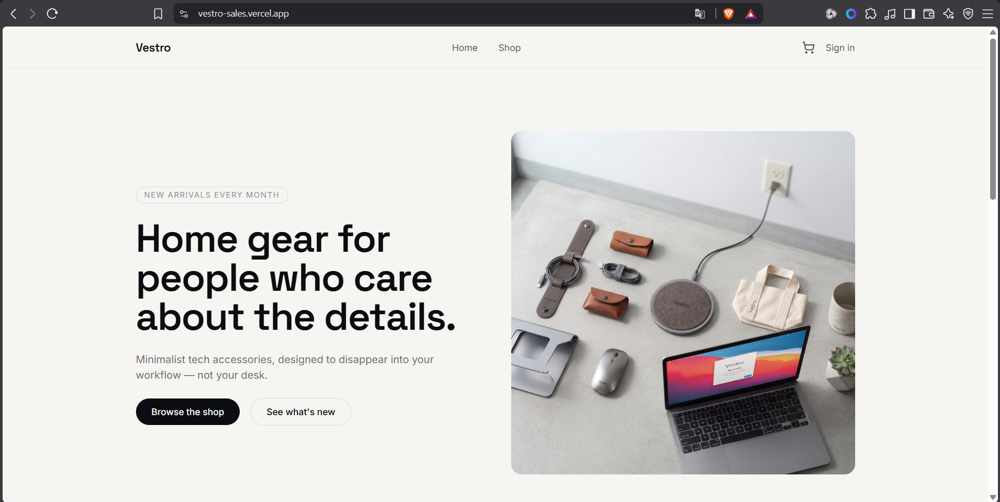
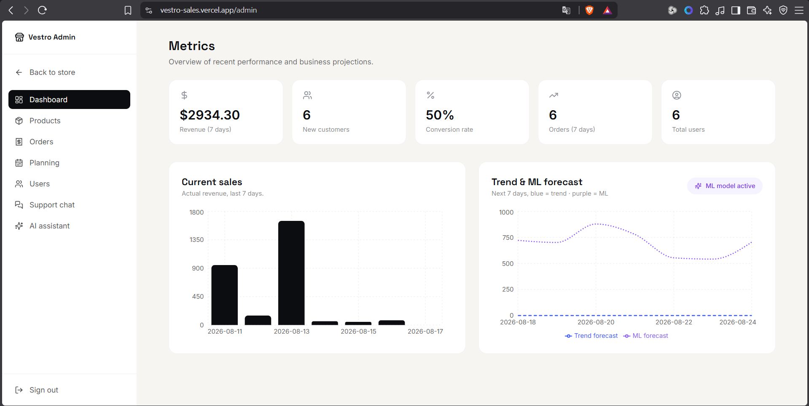
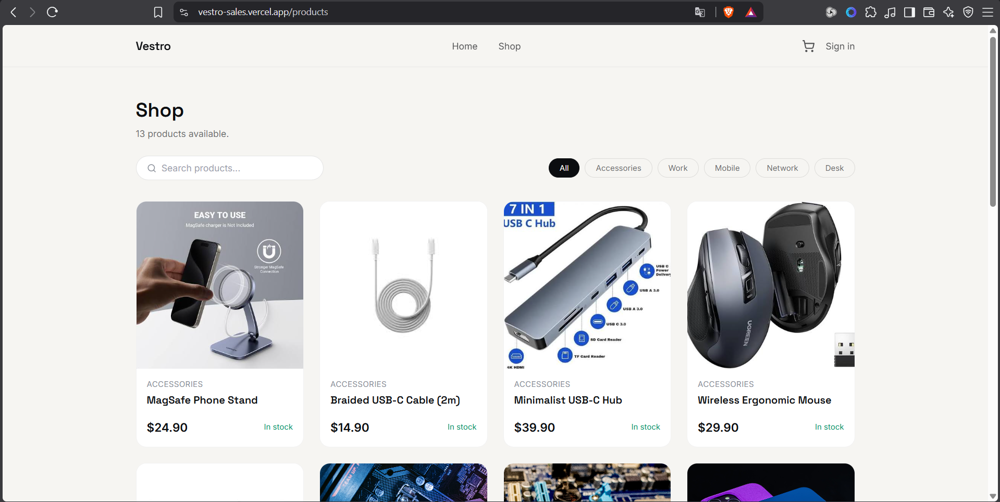
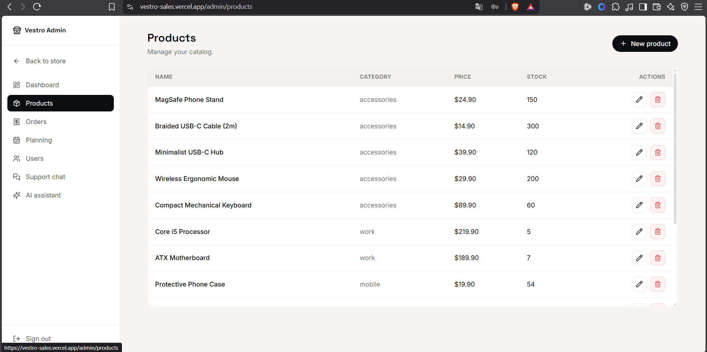
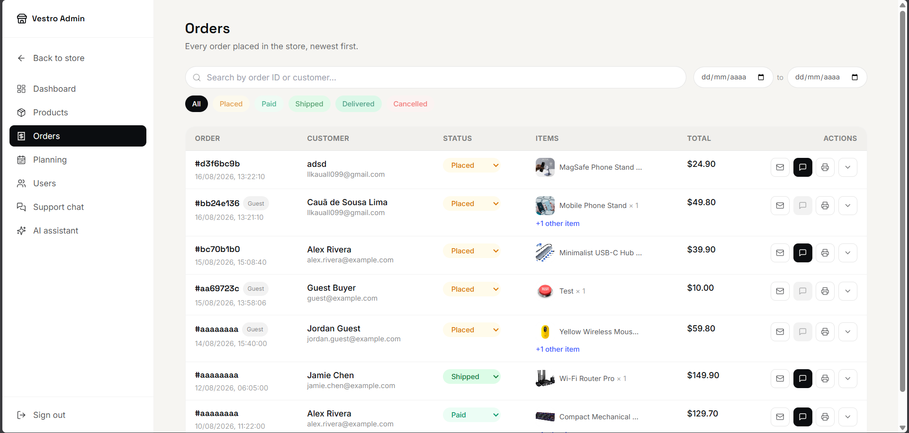
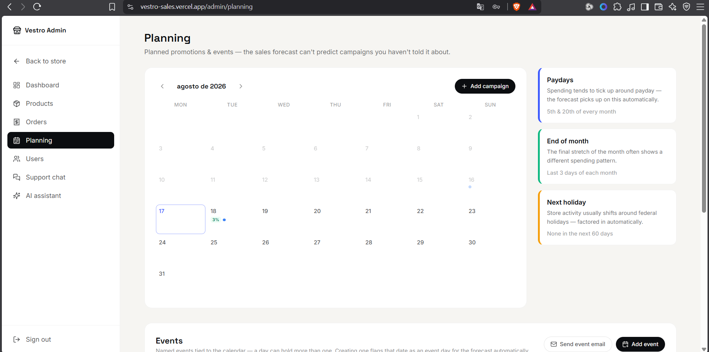
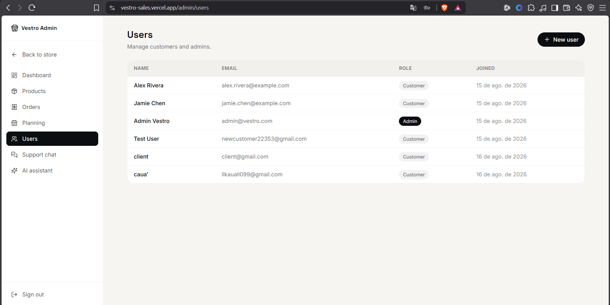
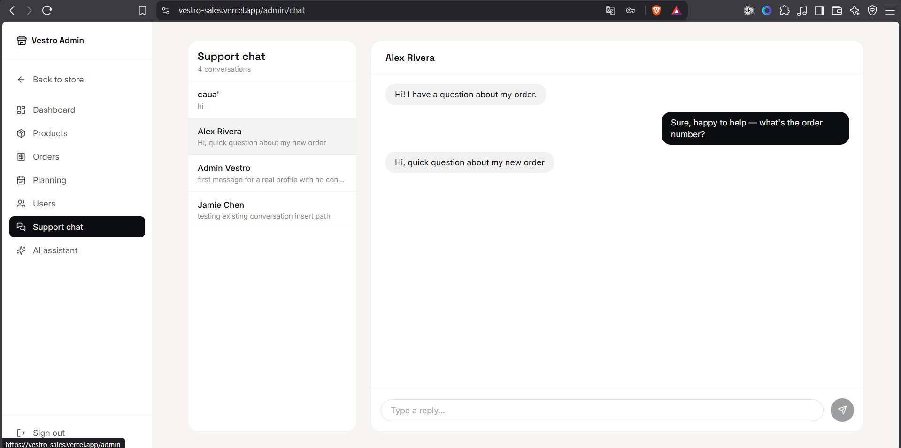
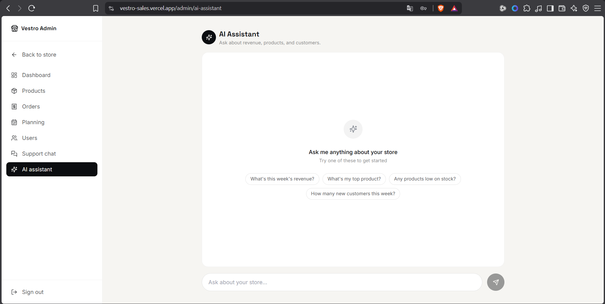

# Vestro Sales

**An AI-driven sales operations platform: e-commerce storefront, admin dashboard, ML-powered demand forecasting, and a Gemini-backed assistant that answers business questions over live data.**

<sub>Read this in other languages: **English** (current) · Português (coming soon)</sub>

[](api-vestro)
[](api-vestro)
[](vestro-sales)
[](vestro-sales)
[](api-vestro/app/ml)
[](api-vestro/app/services/assistant.py)
[](https://supabase.com)
[](LICENSE)
[](#)

---

## Overview

Vestro Sales is a full-stack e-commerce platform built to solve a concrete problem: store admins can see what happened, but not what's coming. The platform pairs a normal storefront (catalog, cart, checkout, orders) with an admin side that forecasts near-term demand from historical sales and calendar context (paydays, holidays, discounts, events), and lets admins ask an AI assistant plain-language questions about the business — revenue this week, top products, low stock, new customers — answered from live data instead of a canned FAQ.

It's a monorepo with two independently deployable pieces:

| | |
|---|---|
| [`api-vestro/`](api-vestro) | FastAPI backend — REST API, auth, ML forecasting, Gemini integration |
| [`vestro-sales/`](vestro-sales) | Next.js frontend — storefront + admin dashboard |

## System Architecture

```
┌──────────────────────┐            HTTPS / JSON             ┌───────────────────────────┐
│       Frontend         │ ───────────────────────────────────▶ │         Backend             │
│  Next.js 16 (App Router)│ ◀─────────────────────────────────── │  FastAPI (Python 3.12)      │
│  Vercel                 │        Bearer token (Supabase)       │  Render                     │
└──────────────────────┘                                      └───────────┬───────────────┘
                                                                             │
                              ┌──────────────────────────────┬───────────────┼───────────────────────┐
                              ▼                              ▼                                        ▼
                    ┌───────────────────┐         ┌───────────────────────┐             ┌───────────────────────┐
                    │      Supabase       │         │   LightGBM forecaster   │             │      Gemini API         │
                    │ Auth · Postgres      │         │  (app/ml — trained on   │             │  AI Assistant chat,      │
                    │ Realtime (chat)      │         │  sales + calendar data) │             │  grounded in live data   │
                    └───────────────────┘         └───────────────────────┘             └───────────────────────┘
                              │
                              ▼
                    ┌───────────────────┐
                    │       Resend         │
                    │  marketing emails     │
                    └───────────────────┘
```

The backend also runs an in-process scheduler that retrains the forecasting model daily against fresh sales data, so the model doesn't drift stale between deploys.

## Technical Highlights

- **Machine learning pipeline** — a LightGBM regressor forecasts next-day (and rolling 7-day) sales from engineered features: day of week, rolling 7-day mean, paydays, end-of-month, proximity to holidays, active discounts, and scheduled events. Trains via CLI or an authenticated `POST /api/sales/retrain`, and auto-retrains daily. Degrades gracefully (`model_available: false`) instead of failing when no model is trained yet.
- **AI-powered business assistant** — `POST /api/ai/assistant` builds a live context snapshot from Supabase (recent revenue, order counts, new customers, next forecast point, top product, low-stock items), grounds a Gemini prompt in it, and constrains answers to that data. Falls back to a keyword-matched answer if `GEMINI_API_KEY` is unset or the call fails, so the feature never hard-errors.
- **Real-time-ish support chat** — a shared conversation model lets customers message support from the storefront and admins answer from the dashboard.
- **Role-gated admin surface** — products, orders, users, discounts, calendar planning, and marketing sends are all admin-only, enforced server-side via Supabase-verified bearer tokens, not just hidden in the UI.

## Tech Stack

**Frontend**
Next.js 16 (App Router, Turbopack) · React 18 · TypeScript · Tailwind CSS · Framer Motion · Recharts · Supabase JS client

**Backend**
FastAPI · Uvicorn · Pydantic v2 · Python 3.12 · asyncio scheduler for daily retraining

**AI / ML**
LightGBM (scikit-learn API) · scikit-learn · pandas · NumPy · SciPy · Google Gemini API (`google-genai`)

**Infrastructure**
Supabase (Auth, Postgres, Realtime) · Render (backend hosting) · Vercel (frontend hosting) · Resend (transactional/marketing email)

## Prerequisites & Quick Start

You'll need a Supabase project (Postgres + Auth) and, optionally, a Gemini API key and a Resend API key — both integrations degrade gracefully without one, so you can run the whole thing with just Supabase.

```bash
# 1. Backend
cd api-vestro
python -m venv .venv
.venv/Scripts/activate            # .venv/bin/activate on macOS/Linux
pip install -r requirements.txt
cp .env.example .env              # fill in SUPABASE_* at minimum
uvicorn app.main:app --reload --port 8000

# 2. Frontend (separate terminal)
cd vestro-sales
npm install
cp .env.local.example .env.local  # fill in NEXT_PUBLIC_SUPABASE_* and NEXT_PUBLIC_API_URL
npm run dev
```

The frontend expects the API at `NEXT_PUBLIC_API_URL` (defaults to `http://localhost:8000`). See each package's own README for full setup, environment variables, and endpoint details:

- [`api-vestro/README.md`](api-vestro/README.md)
- [`vestro-sales/README.md`](vestro-sales/README.md)

## Demo

| Storefront | Admin Dashboard |
|---|---|
|  |  |

| Shop | Products |
|---|---|
|  |  |

| Orders | Planning |
|---|---|
|  |  |

| Users | Support Chat |
|---|---|
|  |  |

| AI Assistant |
|---|
|  |

## Author

**Cauã Sousa**
[GitHub @cauasousa](https://github.com/cauasousa) · LinkedIn — https://www.linkedin.com/in/cau%C3%A3-de-sousa-lima-9734a7259/ · Portfolio — https://caua-sousa-dev.vercel.app/
